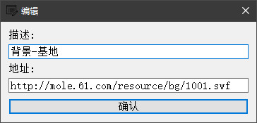

# 程序介绍
「FlashGameStreamline」也叫「Flash 页游加速工具」，本质上是一个 HTTP 代理工具。它通过自定义规则拦截特定资源的下载，以提高游戏运行速度，特别适用于那些年久失修、臃肿无比的上古页游。

程序截图：


## 下载地址

提供两种下载方式：

- 方式一：访问 [release 页面](https://github.com/hxz393/FlashGameStreamline/releases) 下载最新版本的可执行文件，下完可直接打开使用。
- 方式二：通过[百度网盘](https://pan.baidu.com/s/1RK7uBqaqgqJHLJbadXI48g?pwd=6666)下载相应的压缩包，下载后请先解压再使用。

在「帮助」菜单中，有「检查更新」功能，可用于检测新版本的发布。

## 自行打包

非 Windows 用户需自行打包成可执行文件，要求安装 `Python 3.8` 或更高版本以及 `pyinstaller` 库。程序依赖的第三方库主要包括 `PyQt5` 和 `mitmproxy`，可以通过 `pip install` 命令安装。

打包步骤如下：

1. 使用 `Git` 命令克隆项目，下载源代码：

   ```sh
   git clone https://github.com/hxz393/FlashGameStreamline.git
   ```

   或者在 [项目主页](https://github.com/hxz393/FlashGameStreamline) 点击绿色`<> Code` 按钮选择 `Download ZIP` 选项，下载源码压缩包并解压缩。

2. 使用命令切换到项目路径下面。例如，在 Linux 系统下面，可以使用 `cd` 命令切换到项目目录下：

   ```sh
   cd /root/FlashGameStreamline
   ```

   如果安装了 IDE，可以直接打开项目，在 IDE 的控制台输入下面打包命令。

3. 用 `pyinstaller` 命令将项目编译打包成可执行文件：

   ```sh
   pyinstaller --additional-hooks-dir=hooks -F -i media/main.ico --add-data 'media/;media' FlashGameStreamline.py
   ```

   若编译过程无误，可执行文件将会生成在 `dist` 目录下。

## 模块说明

项目的结构说明如下：

- `FlashGameStreamline.py`：程序主入口文件。
- `config/`：配置目录，包含语言字典和全局变量。
- `doc/`：文档相关目录。
- `hooks/`：为 `pyinstaller` 打包提供支持的钩子脚本目录。
- `lib/`：实用功能库，存放通用函数。
- `media/`：媒体文件目录，存放图标资源。
- `ui/`：和 UI 定义操作相关的模块。

该项目没有使用 `Qt Designer` 设计界面，也没有采用 `Qt Linguist` 进行语言翻译，因此没有相应的原始文件。

## 开源许可

本程序采用 [GPL-3.0 license](https://github.com/hxz393/BaiduPanFilesTransfers/blob/master/LICENSE) 许可证，对于违反开源社区基本规则、私自将开源项目用于商业目的的行为，属于侵权，开发者将追究相关法律责任。


# 首次配置

本程序开发和使用环境为 `Win10 x64` 系统，无需安装、随身携带、打开即用。首次使用需进行一些准备工作，之后可直接打开并启动。

## 基本设置

打开程序后，首先点击齿轮图标查看主要设置：


各设置选项说明如下：

- **选择语言**：默认为英语，可以点选设置成中文。
- **监听端口**：代理服务器监听端口，默认为 `12345`。可设置端口范围为 `1` 到 `65535`，只需避免端口冲突即可。
- **配置文件**：用户配置文件存放用户自定义屏蔽地址列表，文件为 `json` 格式，通常放在 `config` 目录中。可根据不同游戏使用不同的配置文件，通过选择相应文件进行切换。

主配置文件路径为 `config/config_main.json`，点击确认按钮即可保存设置并立即生效。

## 配置代理

鉴于最新「Chromium」系浏览器使用代理服务要修改系统设置（位于「网络和 Internet」-「代理」-「手动设置代理」），会影响大多数网络程序的正常工作，因此建议使用专门浏览器来玩页游。推荐使用「[搜狗浏览器 7.0.6.24466](http://dl.61.com/sogou/sogou_explorer_7.0_0502.exe)」，其内置 Flash 插件，并允许在浏览器内独立配置代理，避免影响其他程序。下面也以此浏览器为例进行说明。

首先，在「FlashGameStreamline」程序「开始」菜单中选择「启动程序」，或点击启动按钮以启动服务。

接着，转到浏览器，点击菜单栏「工具」-「代理设置」-「代理服务器设置」，打开「自定义代理」页面：


点击「添加」按钮来新增代理服务器信息，可以照下面截图填写。若修改了「FlashGameStreamline」程序的默认监听端口，则此处的「端口」应填写为修改后的端口号：


点击「确定」后完成设置，可以尝试在浏览器中访问百度网站。如果出现「错误信息 : 代理服务器连接失败」的提示，则表示代理服务器启动失败或浏览器代理设置有误。否则会提示「当前网页不可信」。

要关闭浏览器代理，点击「工具」-「代理设置」-「不使用任何代理」来停用。

## 安装证书

只有在安装了证书之后，才能正常处理 HTTPS 链接。配置好代理后，在浏览器打开网址：http://mitm.it/ 会显示如下页面：


点击「Windows」下的绿色按钮来下载证书，然后打开证书文件，弹出「证书导入向导」：


连续点击「下一步」和「是」，直到出现「导入成功」的提示，此时证书安装完成。


# 程序使用

完成首次配置工作后，程序已经能正常工作。下一步是添加自定义规则来阻拦特定的网址。

## 启动停止

要启动服务，请点击程序的「开始」菜单中的「启动程序」选项，或直接单击启动按钮。服务启动成功后，状态栏会显示「代理服务器运行中...」。请注意，在服务运行状态下，任何对规则的编辑（包括启用、停用、新增、修改和删除）都不会立即生效，需要重启程序才能应用新规则。

点击窗口最小化按钮，程序将隐藏到任务栏的托盘区域，但仍保持后台运行。通过单击托盘区域的程序图标，可以切换程序的「显示/隐藏」状态。

目前，程序不提供停止或暂停功能。要停止服务，请直接点击「开始」菜单中的「退出程序」选项或关闭窗口按钮。

## 配置规则

要配置规则，可以在表格中右键菜单或菜单栏中选择「编辑」菜单下的「新增」或「修改」选项。以下是一个示例：



在上面的示例中，地址输入 `http://mole.61.com/resource/bg/1001.swf` 表示要在游戏中屏蔽地图背景中的基地图片资源。

也可以输入地址的一部分，如 `http://mole.61.com/resource/bg/`，来屏蔽所有匹配的资源，包括基地图片资源 `http://mole.61.com/resource/bg/1001.swf` 和背景中的生命树图片资源 `http://mole.61.com/resource/bg/8024.swf` 等。这种屏蔽方式更加方便，但需要自行测试以确定具体应该输入什么地址。

新增或编辑的规则默认处于未启用状态。要启用规则，请先选中规则，然后在右键菜单中选择「启用」。停用规则的操作类似，并且支持多选进行批量操作。

若某些规则不再需要，可以在表格中选择这些规则，然后通过右键菜单选择「删除」选项进行移除。

## 查看日志

代理服务器在运行过程中会记录所有访问的地址和状态。通过选择菜单栏中的「帮助」-「查看日志」，可以打开日志查看窗口：


日志中黄色标记的记录表示指定的地址已被代理服务器阻拦，并返回 `403` 状态码。可以点击「刷新」按钮，来持续刷新日志信息。

对于没有设置防盗链的网站，可以直接复制资源地址，在浏览器中访问以查看内容：


如上图所示，展示的是一个 NPC 的皮肤。若想屏蔽这类资源，可以将地址 `http://hua.61.com/resource/jobNpc/npcbody/` 新增到规则列表中。

## 反馈问题

程序运行异常时，先查看运行日志是否有显而易见的错误，然后查看所有 [Issue](https://github.com/hxz393/FlashGameStreamline/issues) 中是否有相同问题。如需进一步帮助，可以提交新 Issue ，并附上相关日志。


# 更新日志

为避免更新日志过长，只保留最近更新日志。

## 版本 1.0.1（2024.04.15）

修复内容：

1. 修复程序最小化时，关闭子窗口（日志、关于）意外导致程序退出。

## 版本 1.0.0（2024.03.27）

发布第一个版本。

